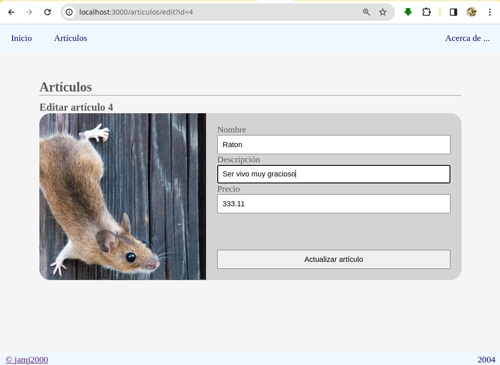

# Aplicación NextJS: CRUD MySQL

Esta aplicación tiene fines didácticos.

## Prerrequisitos

- Base de datos MySQL local
  
## Características principales de la aplicación

Permite:

- Guardar en BD un artículo
- Obtener de BD los artículos
- Actualizar en BD un artículo
- Eliminar de BD un artículo

## Otras características

**Cada artículo puede tener una imagen asociada**.

La imagen se sube al cloud de [Cloudinary](https://cloudinary.com/)

La imagen se escala y recorta al subirla, para que todas ellas tengan el mismo formato.

**Se permite arrastar y soltar para actualizar imagen**.

Se han definido manejadores para varios eventos. Por ejemplo, es posible arrastrar y soltar una imagen sobre la anterior para actualizarla.

También se puede hacer doble clic en la imagen, y nos aparecerá el explorador de archivos para seleccionar la imagen a subir.

**Se usa un esqueleto de precarga CSS para los artículos**.

La página que muestra la lista de artículos hace uso de un esqueleto de precarga CSS para mejorar la experiencia del usuario.

También se hace uso del componente `Suspense` de `react` para evitar la carga inicial de la página.

Por último, para comprobar que lo anterior funciona bien, se ha introducción un retardo artificial en la recuperación de datos de la BD.

## Si deseas probar la applicación ...

1. Crea una base de datos de MySQL local

2. Ejecuta el script `src/database/db.sql` para crear la tabla `articulos`

3. Crea una cuenta en Cloudinary y obtén los datos de conexión. 


4. Crea un archivo `.env` con los datos de conexión a cloudinary y a mysql. Puedes usar como base el archivo `.env.example`


5. Ejecuta

```sh
git clone https://github.com/jamj2000/nxmysql-app.git
cd  nxmysql-app
npm install 
npm run dev
```

6. Abre la URL http://localhost:3000 en tu navegador web

